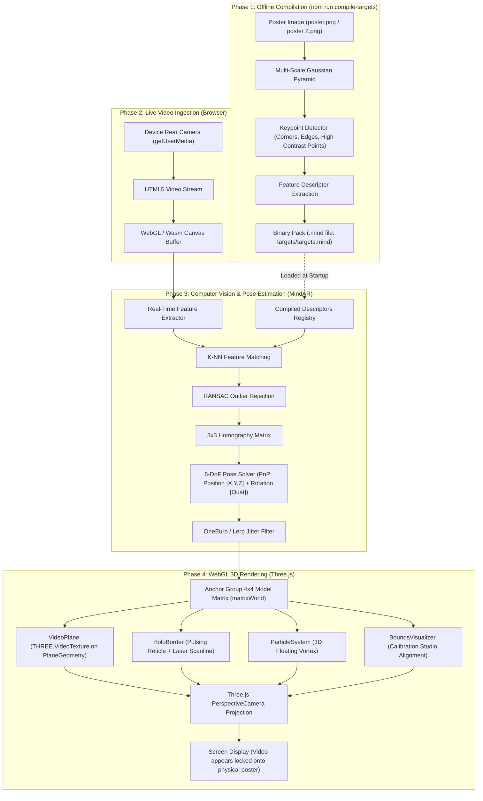
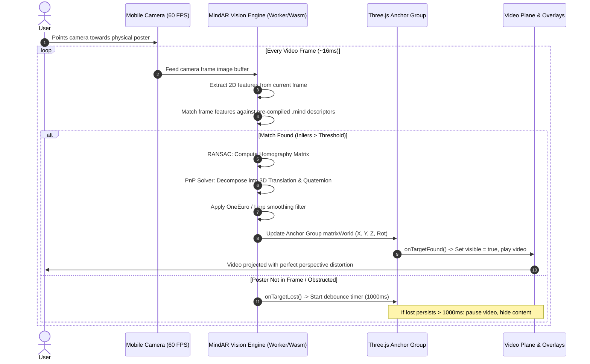
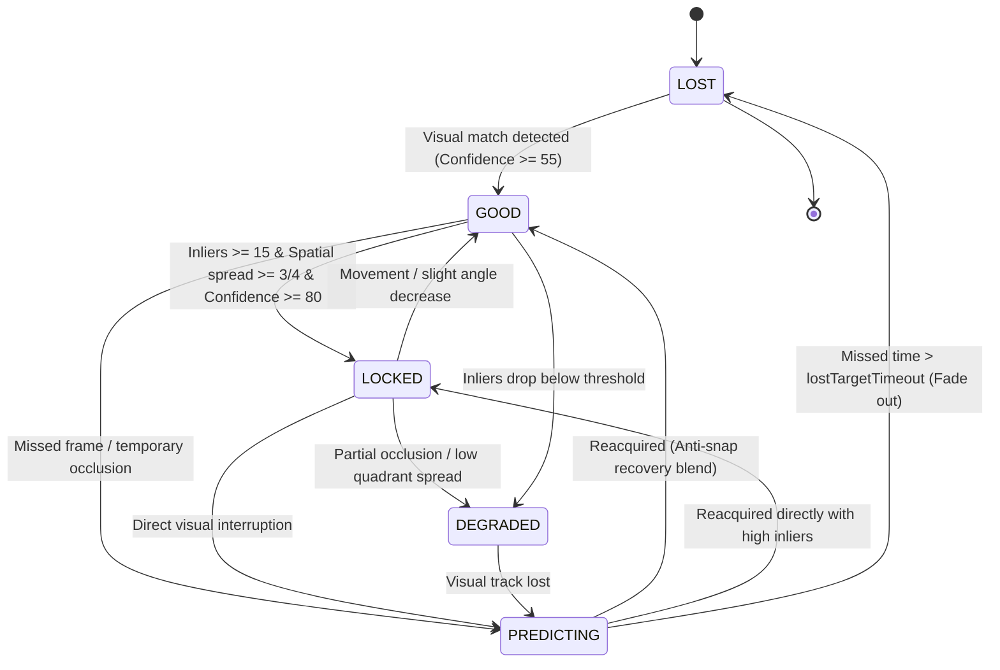

# WebAR Multi-Target Tracking & Poster Recognition Engine

An in-depth guide and technical specification explaining how optical image tracking, computer vision feature matching, 6-DoF pose estimation, and perspective-locked 3D WebGL rendering operate in this WebAR event poster application.

---

## Table of Contents

1. [Executive Summary & Concept](#1-executive-summary--concept)
2. [End-to-End System Architecture](#2-end-to-end-system-architecture)
3. [Phase 1: Target Image Feature Compilation (Offline)](#3-phase-1-target-image-feature-compilation-offline)
   - [Multi-Scale Gaussian Pyramid](#multi-scale-gaussian-pyramid)
   - [Keypoint Detection & Natural Feature Tracking (NFT)](#keypoint-detection--natural-feature-tracking-nft)
   - [Descriptor Extraction](#descriptor-extraction)
   - [Serialization to `.mind` Binary Format](#serialization-to-mind-binary-format)
4. [Phase 2: Real-Time Optical Tracking & Computer Vision (Runtime)](#4-phase-2-real-time-optical-tracking--computer-vision-runtime)
   - [Camera Stream Ingestion](#camera-stream-ingestion)
   - [Real-Time Feature Detection & K-NN Matching](#real-time-feature-detection--k-nn-matching)
   - [Outlier Rejection (RANSAC) & Homography Computation](#outlier-rejection-ransac--homography-computation)
   - [6-DoF Pose Estimation (Perspective-n-Point / PnP)](#6-dof-pose-estimation-perspective-n-point--pnp)
   - [Temporal Smoothing & Jitter Reduction (OneEuro / Lerp Filtering)](#temporal-smoothing--jitter-reduction-oneeuro--lerp-filtering)
5. [Phase 3: How Content Becomes Visible on Scanning (The AR Pipeline)](#5-phase-3-how-content-becomes-visible-on-scanning-the-ar-pipeline)
   - [Step 1: Pointing Camera & Scanning Phase](#step-1-pointing-camera--scanning-phase)
   - [Step 2: Target Recognition (`targetFound` Event)](#step-2-target-recognition-targetfound-event)
   - [Step 3: Three.js World Matrix Transformation & 3D Anchor Group](#step-3-threejs-world-matrix-transformation--3d-anchor-group)
   - [Step 4: Video Plane Texture Streaming & GPU Mapping](#step-4-video-plane-texture-streaming--gpu-mapping)
   - [Step 5: Dynamic Fallback Cyber Visualizer](#step-5-dynamic-fallback-cyber-visualizer)
   - [Step 6: Layered 3D Overlays (Holo-Border & Particle Vortex)](#step-6-layered-3d-overlays-holo-border--particle-vortex)
   - [Step 7: Real-Time Perspective Locking (6-DoF Motion Tracking)](#step-7-real-time-perspective-locking-6-dof-motion-tracking)
   - [Step 8: Target Occlusion & Debounced Loss Handling (`targetLost`)](#step-8-target-occlusion--debounced-loss-handling-targetlost)
6. [Mobile Autoplay & Audio Architecture](#6-mobile-autoplay--audio-architecture)
7. [Multi-Target Tracking & Mutual Exclusion](#7-multi-target-tracking--mutual-exclusion)
8. [Codebase Architecture & File Responsibilities](#8-codebase-architecture--file-responsibilities)
9. [How to Add New Posters & Videos](#9-how-to-add-new-posters--videos)
10. [Poster Design Guidelines for Maximum Tracking Accuracy](#10-poster-design-guidelines-for-maximum-tracking-accuracy)
11. [Troubleshooting & Calibration Studio](#11-troubleshooting--calibration-studio)

---

## 1. Executive Summary & Concept

This project implements **Markerless Natural Feature Tracking (NFT) WebAR**. Unlike traditional QR codes or black-and-white ArUco markers, natural feature tracking recognizes the physical graphics, typography, and contrast of an ordinary printed poster and anchors dynamic digital media (video, 3D particles, holographic effects, and audio) directly onto its physical surface.

### The Core Experience
1. The user opens the web page on their mobile browser (`http://...` or HTTPS).
2. The browser requests camera access (`navigator.mediaDevices.getUserMedia`).
3. The user points their rear camera at a physical event poster (e.g. **Poster 1** or **Poster 2**).
4. Within milliseconds, the computer vision engine locks onto the poster's visual features.
5. A synchronized AR video instantly appears pinned to the poster, playing in real time, conforming precisely to the poster’s 3D angle, tilt, distance, and perspective.
6. As the user moves their phone around the poster—tilting, walking closer, or viewing it from an acute angle—the digital video and holographic overlays stay glued to the paper in 3D space with zero noticeable drift.

---

## 2. End-to-End System Architecture



---

## 3. Phase 1: Target Image Feature Compilation (Offline)

Before the phone's camera can recognize a poster in real-time at 60 FPS, the poster's visual signature must be pre-calculated. This process is handled by `tools/compile-targets.mjs` and MindAR's `Compiler`.

```
[ Poster Image ] ➔ [ Downsample Pyramid ] ➔ [ Detect Keypoints ] ➔ [ Extract Descriptors ] ➔ [ targets.mind ]
```

### Multi-Scale Gaussian Pyramid
A user might stand 2 meters away from the poster (where the poster is small in the camera view), or walk up to 20 cm away (where the poster fills the entire screen). 
To make recognition **scale-invariant**, the compiler builds a pyramid of the poster image at multiple decreasing resolutions (e.g. 100%, 75%, 50%, 35%, 25%, 15%). Features extracted across all levels allow tracking at varying physical distances.

### Keypoint Detection & Natural Feature Tracking (NFT)
The algorithm inspects the image pixels for distinctive mathematical landmarks:
- High local gradient variations (sharp edges and high-contrast intersections).
- Distinct corners and asymmetrical shapes.
- Text characters and logo vertices.

Uniform regions (flat solid backgrounds, gradients, or smooth skin tones) contain zero usable keypoints and are ignored. Highly textured areas yield dense clusters of keypoints.

### Descriptor Extraction
For every identified keypoint $(x, y)$, the compiler analyzes a small window of neighboring pixels to construct an invariant **feature descriptor** (a compact mathematical vector representing local gradient orientations). Even if lighting shifts or the camera approaches from an angle, these relative gradient vectors remain recognizable.

### Serialization to `.mind` Binary Format
All extracted keypoints, their scale-pyramid octaves, their descriptors, and the original target aspect ratio are serialized into a highly optimized binary format (`.mind`):
- `poster 2.png` $\rightarrow$ Target Index `0`
- `poster.png` $\rightarrow$ Target Index `1`

Both are bundled into `public/targets/targets.mind`. At application load, this file (typically ~100–300 KB) is downloaded into the browser via `fetch()`, ready for instant matching.

---

## 4. Phase 2: Real-Time Optical Tracking & Computer Vision (Runtime)

Once the user clicks **"Tap to Start Camera"**, the following computer vision loop runs continuously on every video frame:



### Camera Stream Ingestion
- `navigator.mediaDevices.getUserMedia({ video: { facingMode: 'environment' } })` grabs the high-resolution rear camera.
- MindAR scales the camera feed to an optimal resolution for the computer vision pipeline (typically $640 \times 480$ or $1280 \times 720$) to ensure high framerates on mobile chipsets.

### Real-Time Feature Detection & K-NN Matching
- For each camera frame, the engine detects keypoints and extracts their descriptors using WebAssembly (Wasm) and SIMD acceleration.
- It performs nearest-neighbor matching between the live camera features and the target descriptors stored in memory.

### Outlier Rejection (RANSAC) & Homography Computation
- Because of camera noise, motion blur, and background clutter, some feature matches are incorrect (false positives).
- **RANSAC (Random Sample Consensus)** iteratively tests random subsets of feature pairs to find the mathematical transformation that satisfies the largest consensus of matches (the *inliers*).
- From these inliers, a $3 \times 3$ **Homography Matrix** is calculated, mapping 2D points on the physical poster to 2D points on the camera sensor.

### 6-DoF Pose Estimation (Perspective-n-Point / PnP)
- Knowing the camera’s intrinsic focal length and field of view, the engine solves the **Perspective-n-Point (PnP)** problem.
- This decomposes the 2D homography into a complete **6 Degrees of Freedom (6-DoF) 3D Pose**:
  1. **Translation Vector** $(t_x, t_y, t_z)$: The exact physical position of the poster relative to the camera center (where $z$ represents distance from the camera).
  2. **Rotation Representation** (Quaternion $[q_x, q_y, q_z, q_w]$): The 3D orientation (Pitch, Yaw, and Roll) of the poster plane relative to the camera lens.

### Temporal Smoothing & Adaptive 1 Euro Filtering
Raw frame-by-frame optical pose estimation is subject to subtle micro-jitter caused by sensor noise, lighting variations, or micro-hand tremors.
To eliminate jitter when stationary while preserving zero-lag responsiveness when the phone moves, the engine utilizes an **Adaptive 1 Euro Filter** (`ar/tracking-coordinator.js`):
- **Stationary / Low Speed:** Cutoff frequency drops to `filterMinCF` ($0.001$), eliminating vibration and holding the 3D video rock-steady on the paper.
- **Dynamic Motion:** As velocity $|\dot{x}|$ increases, cutoff frequency scales dynamically: $f_c = f_{c,\text{min}} + \beta |\dot{x}|$, with $\beta = 80.0$, eliminating lag and latency.
- **Rotational Stability:** Quaternions are filtered with sign-normalization ($q \cdot q_{\text{prev}} \ge 0$) to prevent shortest-path inversion artifacts, then dynamically normalized on each frame.

### 5-Tier Tracking State Architecture & Telemetry Confidence
Rather than a fragile binary `FOUND / LOST` switch, the tracking coordinator maintains a continuous **0–100 Confidence Score** and a **5-tier finite state machine**:



| Tracking State | Confidence Range | Trigger Condition & Behavior | Visual & Video Impact |
| :--- | :--- | :--- | :--- |
| **`LOCKED`** | $80 - 100\%$ | High inliers ($\ge 15$), $\ge 3/4$ quadrants covered, low pose delta. | Video & 3D elements pinned with highest precision. Full opacity. |
| **`GOOD`** | $55 - 79\%$ | Solid visual recognition, stable pose estimation. | Standard tracking mode. Full opacity, video playing smoothly. |
| **`DEGRADED`** | $30 - 54\%$ | Low inlier count ($< 10$), partial occlusion (1–2 quadrants covered), or steep camera angle. | Content remains locked to poster; filters increase damping to reject false-positive jumps. |
| **`PREDICTING`** | $15 - 50\%$ | Visual line-of-sight interrupted (hand, obstruction, or rapid pan). Last known velocity is extrapolated with polynomial damping $\gamma(t) = \max(0, 1 - t/T_{\text{pred}})^{1.5}$. | **Content remains visible!** Video continues playing without pausing. Zero flicker. |
| **`LOST`** | $0\%$ | Occlusion exceeds `lostTargetTimeout` ($1200\text{ ms}$). | Smooth $250\text{ ms}$ fade-out initiates. Once fully faded, video pauses and guidance prompt reappears. |

### Multi-Factor Confidence Scoring Formula
Tracking confidence is calculated per-frame from 4 real optical telemetry sources:
$$C = 0.35 C_{\text{inliers}} + 0.30 C_{\text{spatial}} + 0.20 C_{\text{pose}} + 0.15 C_{\text{continuity}} + B_{\text{hits}}$$
1. **$C_{\text{inliers}}$ (Inlier Count):** Normalized ratio of verified RANSAC matches against ideal baseline ($26$).
2. **$C_{\text{spatial}}$ (Quadrant Coverage):** Divides the poster into 4 quadrants ($Q_1..Q_4$). Full coverage across all 4 quadrants provides maximum geometric certainty.
3. **$C_{\text{pose}}$ (Pose Stability):** Penalizes abrupt teleports ($> 0.15\text{m}$) or sudden angular jumps ($> 20^\circ$) to reject spurious background noise.
4. **$C_{\text{continuity}}$ (Historical EMA):** Exponential moving average ($0.82 / 0.18$) ensuring temporal stability.
5. **$B_{\text{hits}}$ (Hit Streak Bonus):** Adds stability bonus as tracking persists uninterrupted.

---

## 5. Phase 3: How Content Becomes Visible on Scanning (The AR Pipeline)

How does a 2D MP4 video and 3D graphics become projected onto a physical piece of paper? Here is the step-by-step pipeline across the code:

### Step 1: Pointing Camera & Scanning Phase
When the app launches:
- `main.js` initializes `ARManager` and displays a floating UI prompt: `Point the camera to the poster`.
- The Three.js `PerspectiveCamera` is configured to match the physical aspect ratio and field of view of the smartphone camera sensor.
- The `VideoPlane` mesh and 3D animations are already instantiated in memory, but their parent container (`contentGroup.visible`) is set to `false`. The video is paused.

### Step 2: Target Recognition (`targetFound` Event)
When MindAR registers a confident match for poster index `i`:
```javascript
// ar/ar-manager.js
anchor.onTargetFound = () => {
  // 1. Pause any other poster's video to prevent audio clash
  this.targetItems.forEach((item, idx) => {
    if (idx !== i) item.contentAnchor.videoPlane.pause();
  });

  // 2. Notify content anchor to reveal content
  contentAnchor.onTargetFound();
  this.activeTrackingIndices.add(i);

  // 3. Hide the 'Point camera to poster' prompt
  if (this.onTrackingStateChange) {
    this.onTrackingStateChange('tracking', targetDef);
  }
};
```
Inside `ar/content-anchor.js`:
```javascript
onTargetFound() {
  if (this.lostTimeoutTimer) {
    clearTimeout(this.lostTimeoutTimer);
    this.lostTimeoutTimer = null;
  }
  this.isTracking = true;
  this.contentGroup.visible = true; // Content becomes visible
  this.videoPlane.play();           // Video playback commences
}
```

### Step 3: Three.js World Matrix Transformation & 3D Anchor Group
MindAR creates a Three.js `Group` called `anchor.group`.
Every frame, MindAR writes the calculated 6-DoF pose directly into this group's transform matrix:
- **Center of the poster** is at origin $(0, 0, 0)$.
- **Width** is normalized to $1.0$ Three.js world units.
- **Height** is calculated as $\frac{1.0}{\text{aspectRatio}}$ (for our posters with ratio $941 / 1672 \approx 0.5628$, height $\approx 1.776$ units).
- **Normal Vector** points directly outward from the poster face $(+Z)$.

Because `this.contentGroup` is a child of `anchor.group`, any object placed inside it **automatically inherits the physical poster’s position, rotation, and scale**.

### Step 4: Video Plane Texture Streaming & GPU Mapping
In `ar/video-plane.js`:
1. An invisible HTML5 `<video>` element is created:
   ```javascript
   this.video = document.createElement('video');
   this.video.playsInline = true;
   this.video.setAttribute('webkit-playsinline', 'true');
   this.video.loop = true;
   this.video.muted = true; // Required for mobile autoplay compliance
   this.video.src = this.src;
   ```
2. A `THREE.VideoTexture` is created from that video element:
   ```javascript
   this.texture = new THREE.VideoTexture(this.video);
   this.texture.minFilter = THREE.LinearFilter;
   this.texture.magFilter = THREE.LinearFilter;
   this.texture.format = THREE.RGBAFormat;
   ```
3. A `THREE.PlaneGeometry` matching the poster's exact width ($1.0$) and height ($1.776$) is mapped with this texture using `THREE.MeshBasicMaterial`:
   ```javascript
   const geometry = new THREE.PlaneGeometry(this.width, this.height);
   this.material = new THREE.MeshBasicMaterial({
     map: this.texture,
     side: THREE.DoubleSide,
     transparent: true,
     opacity: 1.0,
     toneMapped: false
   });
   this.mesh = new THREE.Mesh(geometry, this.material);
   this.mesh.position.z = 0.001; // Slightly above poster plane to prevent Z-fighting
   ```
4. Each animation frame, the GPU updates the texture sampler with the current video frame. The video renders on the plane with zero latency.

### Step 5: Dynamic Fallback Cyber Visualizer
If an MP4 video file is missing or fails to load, `VideoPlane` automatically activates an internal procedural HTML5 canvas visualizer (`enableDynamicCanvas()`):
- An animated canvas with a glowing cyber grid, pulsing 28-bar audio equalizer, and rotating HUD rings.
- Transferred to Three.js via `THREE.CanvasTexture(this.canvas)` and updated every frame.
- Guarantees the AR experience never breaks or displays an empty black box.

### Step 6: Layered 3D Overlays (Holo-Border & Particle Vortex)
To enhance the augmented reality illusion beyond a flat video rectangle:
1. **Holographic Cyber Border (`animations/holo-border.js`):**
   - Four glowing corner reticle brackets (`#ff0077` magenta).
   - An outer perimeter frame line (`#00f0ff` cyan) that pulses via sine wave: `const pulse = 0.7 + 0.3 * Math.sin(time * 3.5);`.
   - A vertical green laser scanline (`#00ffaa`) that sweeps up and down the poster face using additive blending (`THREE.AdditiveBlending`).
2. **3D Particle Vortex (`animations/particle-system.js`):**
   - 100+ points suspended in a 3D volume floating $0.01$ to $0.15$ units in front of the poster.
   - Individual drift velocities, sine oscillation, and color transitions (cyan $\rightarrow$ magenta $\rightarrow$ green).
   - Because they have true 3D depth ($Z > 0$), as the user tilts their phone, the particles exhibit natural **parallax**—moving faster than the video plane behind them!

### Step 7: Real-Time Perspective Locking (6-DoF Motion Tracking)
When the user moves the phone:
- **Stepping closer / further:** Translation $t_z$ changes $\rightarrow$ Three.js camera projection scales the mesh larger/smaller on screen.
- **Tilting the phone to the side:** Rotation Quaternion shifts $\rightarrow$ Three.js applies perspective keystoning (one edge appears narrower and compressed, exactly as a physical paper surface would).
- **Moving horizontally / vertically:** Translation $t_x, t_y$ shift $\rightarrow$ Mesh moves in screen coordinates, staying locked to the physical poster edges.

The illusion is complete: the video appears printed onto the paper, animated in real life.

### Step 8: Occlusion Resilience, Velocity Prediction & Anti-Snap Recovery
If someone walks between the camera and the poster, a hand covers a portion of the graphics, or the user pans away momentarily:
1. **Short-Term Predictive Tracking (`PREDICTING` state):**
   - The engine does **not** instantly vanish the 3D content or pause playback.
   - For up to `predictionDuration` ($800\text{ ms}$), the last valid linear velocity vector is integrated with polynomial damping:
     $$\gamma(t) = \max\left(0, 1 - \frac{t_{\text{miss}}}{T_{\text{pred}}}\right)^{1.5}$$
   - If device motion / orientation gyro is enabled, phone rotation is applied to counter-rotate the anchor, keeping the predicted target realistically fixed in 3D world space.
   - The video continues to play without pausing, completely eliminating annoying flashes or resets.
2. **Smooth Anti-Snap Reacquisition Blender:**
   - When the poster is re-detected after an occlusion, rather than snapping instantly to the new raw pose (which causes jarring visual popping), the coordinator blends the pose over `recoveryBlendDuration` ($250\text{ ms}$):
     $$p(t) = \text{lerp}(p_{\text{predicted}}, p_{\text{new}}, S(t)), \quad q(t) = \text{slerp}(q_{\text{predicted}}, q_{\text{new}}, S(t))$$
     where $S(t) = 3t^2 - 2t^3$ (cubic smoothstep).
3. **Graceful Fade-Out on Confirmed Loss (`LOST` state):**
   - Only when occlusion exceeds `lostTargetTimeout` ($1200\text{ ms}$) does the system confirm the target lost.
   - Content initiates a smooth $250\text{ ms}$ alpha fade-out.
   - Once opacity reaches $0$, video pauses to conserve device memory and battery, and the guidance badge *"Point the camera to the poster"* gently fades back in.

---

## 6. Mobile Autoplay & Audio Architecture

### The Mobile Autoplay Barrier
Modern mobile browsers (iOS Safari and Android Chrome) enforce strict autoplay restrictions:
- Videos **cannot** play sound unless triggered directly by an explicit user gesture (a tap/touch event).
- If an application attempts `video.play()` with audio unmuted on page load, the browser rejects the promise with `NotAllowedError`.

### How We Solve It in This App
1. **Initial Muted Boot:** Videos are initialized with `video.muted = true; playsInline = true;`. This guarantees video decoding starts without browser interruption.
2. **Initial Tap Gate:** A clean overlay (`Tap to Start Camera`) ensures at least one user touch interaction occurs.
3. **Seamless Unmute on Tracking:** Upon the very first successful poster detection (`onFirstTrack`), the app calls `arManager.setAudioMuted(false)`.
4. **Global Screen Tap Toggle:** Tapping anywhere on the screen at any time toggles audio mute/unmute state dynamically.

---

## 7. Multi-Target Tracking & Mutual Exclusion

This app supports tracking multiple posters with different videos from a single camera feed:
- **Poster 1 (`poster.png`)** $\rightarrow$ Linked to **`video.mp4`** (Target Index `1`)
- **Poster 2 (`poster 2.png`)** $\rightarrow$ Linked to **`video 2.mp4`** (Target Index `0`)

### How Multi-Targeting Works:
1. When compiled via `npm run compile-targets`, both images are stored in `targets.mind`.
2. In `ar-manager.js`, an anchor is registered for each target index and decoupled from MindAR's hard zero matrix.
3. **Mutual Exclusion:** If Poster 2 is tracked while Poster 1 is already playing, the state machine automatically pauses Poster 1's video, preventing overlapping audio and conserving mobile GPU memory.

---

## 8. Codebase Architecture & File Responsibilities

| File Path | Role & Detailed Responsibility |
| :--- | :--- |
| [`index.html`](file:///c:/Users/mevin_z1mcnwj/Desktop/ar%20poster/index.html) | Sole public entry point. Minimal DOM containing `#arContainer`, loading states, and camera root. |
| [`main.js`](file:///c:/Users/mevin_z1mcnwj/Desktop/ar%20poster/main.js) | Application controller. Coordinates UI overlays, Debug HUD, camera start triggers, audio gestures, and triple-tap admin calibration. |
| [`config/app-config.js`](file:///c:/Users/mevin_z1mcnwj/Desktop/ar%20poster/config/app-config.js) | Declarative registry of all poster targets, aspect ratios, video source fallbacks, and default calibration values. |
| [`ar/ar-manager.js`](file:///c:/Users/mevin_z1mcnwj/Desktop/ar%20poster/ar/ar-manager.js) | Core WebAR manager. Boots `MindARThree`, manages Three.js scene, lighting, camera, multi-target anchors, render loop, and resize handlers. |
| [`ar/tracking-coordinator.js`](file:///c:/Users/mevin_z1mcnwj/Desktop/ar%20poster/ar/tracking-coordinator.js) | 5-tier state machine, multi-factor confidence scoring (0–100), adaptive OneEuro filter, damped velocity predictor, and anti-snap recovery blender. |
| [`ar/content-anchor.js`](file:///c:/Users/mevin_z1mcnwj/Desktop/ar%20poster/ar/content-anchor.js) | Container attached directly to the Three.js scene. Handles 6-DoF pose setting, smooth fade-out on confirmed lost, and uninterrupted video playback. |
| [`ar/video-plane.js`](file:///c:/Users/mevin_z1mcnwj/Desktop/ar%20poster/ar/video-plane.js) | Creates HTML5 video element, maps it to `THREE.VideoTexture`, calculates aspect-ratio geometry, and provides fallback cyberpunk procedural canvas visualizer. |
| [`components/debug-hud.js`](file:///c:/Users/mevin_z1mcnwj/Desktop/ar%20poster/components/debug-hud.js) | Developer Debug HUD showing Target, 5-tier State, Confidence bar, Inliers, Quadrant coverage, Pose delta, Prediction status, and FPS. |
| [`animations/holo-border.js`](file:///c:/Users/mevin_z1mcnwj/Desktop/ar%20poster/animations/holo-border.js) | 3D holographic border overlay. Generates pulsing corner reticles, glowing perimeter frame, and oscillating vertical laser scanline. |
| [`animations/particle-system.js`](file:///c:/Users/mevin_z1mcnwj/Desktop/ar%20poster/animations/particle-system.js) | 3D particle vortex. Generates 100+ ambient floating particles with independent velocity vectors and color gradients in front of the poster. |
| [`ar/bounds-visualizer.js`](file:///c:/Users/mevin_z1mcnwj/Desktop/ar%20poster/ar/bounds-visualizer.js) | 3D alignment visualizer. Renders detected poster perimeter, yellow content bounding box, and 3D coordinate axes for calibration. |
| [`calibration/calibration-manager.js`](file:///c:/Users/mevin_z1mcnwj/Desktop/ar%20poster/calibration/calibration-manager.js) | State persistence for calibration parameters. Saves to `localStorage`, exports/imports JSON configurations. |
| [`calibration/calibration-panel.js`](file:///c:/Users/mevin_z1mcnwj/Desktop/ar%20poster/calibration/calibration-panel.js) | Slide-out admin UI panel with real-time sliders for Position, Rotation, Scale, Prediction Duration, Recovery Blend, and Filters. |
| [`tools/compile-targets.mjs`](file:///c:/Users/mevin_z1mcnwj/Desktop/ar%20poster/tools/compile-targets.mjs) | Headless CLI compiler script. Spawns Edge/Chrome with Chrome DevTools Protocol (CDP) to compile posters into `targets.mind` automatically. |
| [`tools/compiler.html`](file:///c:/Users/mevin_z1mcnwj/Desktop/ar%20poster/tools/compiler.html) | Interactive browser-based Compiler Studio with drag-and-drop keypoint inspector, quadrant crosshairs, rating meter, and `.mind` exporter. |
| [`vite.config.js`](file:///c:/Users/mevin_z1mcnwj/Desktop/ar%20poster/vite.config.js) | Development server configuration, asset loaders, access-control guards, and the `/__save_mind` target persistence endpoint. |

---

## 9. How to Add New Posters & Videos

Adding a 3rd or 4th poster to this application requires only 3 simple steps:

### Step 1: Place Assets in `public/`
- Add your poster image: `public/poster 3.png`
- Add your video file: `public/video 3.mp4`

### Step 2: Register the Target in `config/app-config.js`
Open [`config/app-config.js`](file:///c:/Users/mevin_z1mcnwj/Desktop/ar%20poster/config/app-config.js) and append your new entry to the `TARGETS` array:
```javascript
export const TARGETS = [
  // Existing targets...
  {
    id: 'poster-3',
    name: 'Poster 3 (VIP Launch)',
    imageSrc: './poster 3.png',
    videoSrc: './video 3.mp4',
    aspectRatio: 941 / 1672 // width / height of your poster
  }
];
```

### Step 3: Run the Automated Compiler
Run in your terminal:
```bash
npm run compile-targets
```
The compiler will automatically extract keypoints for all posters in `TARGETS` and output `public/targets/targets.mind`. The new poster is immediately live and trackable!

---

## 10. Poster Design Guidelines for Maximum Tracking Accuracy

Optical feature tracking relies on the physical characteristics of the printed artwork. To ensure instant, rock-solid recognition:

| Characteristic | Optimal for Tracking (★★★★★) | Poor for Tracking (★☆☆☆☆) |
| :--- | :--- | :--- |
| **Contrast** | Bold, high-contrast typography, sharp black-and-white lines, vivid color transitions. | Low contrast, pastel gradients, washed-out tones. |
| **Texture Density** | Rich graphical patterns, micro-textures, geometric shapes, asymmetrical artwork. | Large solid-color backgrounds, empty margins, minimalist blank negative space. |
| **Quadrant Balance** | Features evenly distributed across all 4 quadrants (top-left, top-right, bottom-left, bottom-right). | All artwork clustered in one corner, leaving the rest of the poster blank. |
| **Symmetry** | Asymmetrical design (distinct top, bottom, left, and right). | Radially symmetrical artwork (engine cannot determine orientation if rotated 180°). |
| **Repetition** | Varied, irregular elements and layout. | Highly repetitive patterns (e.g. checkerboards or identical repeating wallpaper). |
| **Finish / Lighting** | Matte paper under diffuse, even lighting. | High-gloss paper producing bright specular reflections or glare spots that wipe out features. |

---

## 11. Troubleshooting, Developer Debug HUD & Calibration Studio

### Developer Debug HUD
To inspect real-time tracking metrics while testing posters:
- **Activate via URL:** Open `http://localhost:5173/?debug=true` or append `#debug`.
- **Activate via Studio:** Open Calibration Studio and toggle **Show Developer Debug HUD**.
- **Metrics Displayed:**
  - **Active Target:** Current recognized poster.
  - **Tracking State:** Color-coded 5-tier state badge (`LOCKED`, `GOOD`, `DEGRADED`, `PREDICTING`, `LOST`).
  - **Tracking Confidence:** Live 0–100% score bar.
  - **Visual Inliers:** Active RANSAC inlier count.
  - **Quadrant Spread:** Quadrant distribution (e.g. `4/4 quadrants`).
  - **Pose Delta:** Real-time distance variation between camera and poster.
  - **Prediction Status:** Real-time indicator showing if damping velocity extrapolation is active during occlusion.
  - **Performance:** Live WebGL rendering FPS counter.

### Live Calibration Studio
If the video appears slightly misaligned with your physical print (e.g. print margins or bleed differences), use the built-in Calibration Studio:
- **Access:** Triple-tap the screen, click the subtle gear icon in the top right, or visit `http://localhost:5173/?admin=true`.
- **Controls:**
  - **Position (X, Y, Z):** Fine-tune alignment and depth.
  - **Scale & Aspect (Uniform, Width Ratio, Height Ratio):** Adjust sizing to match physical paper exactly.
  - **Rotation (Roll, Pitch, Yaw):** Compensate for physical poster mounting angle.
  - **Prediction Duration:** Control how long content stays anchored during brief occlusion (default $800\text{ ms}$).
  - **Lost Target Debounce:** Time before content fades out when completely obstructed (default $1200\text{ ms}$).
  - **Recovery Blend:** Anti-snap slerp/lerp transition time on reacquisition (default $250\text{ ms}$).
  - **Adaptive Filter Beta:** Responsiveness vs. smoothing during rapid device motion.
  - **Device Motion Assist:** Toggle phone gyro integration for occlusion prediction.
  - **Visual 3D Bounding Box:** Toggles the cyan/yellow wireframe overlay and 3D coordinate axes.
- **Save & Export:** Click **Save Calibration** to store settings in `localStorage`, or **Export JSON** to commit changes to `config/default-calibration.json`.

### Common Issues & Solutions
1. **Camera permission denied / black screen:**
   - Mobile browsers require **HTTPS** (or `localhost`) for camera access. On a local network, use Vite's local network IP or an HTTPS tunnel (e.g. ngrok or Vercel).
2. **Video plays without sound:**
   - Mobile browser policy starts videos muted. Tap anywhere on the screen once the poster is tracked to unmute audio.
3. **Tracking feels jittery:**
   - Click **Optimize for Universal Tracking** in the Calibration Studio to apply the tuned OneEuro parameters, or ensure the poster is evenly lit and free from reflective glare.

